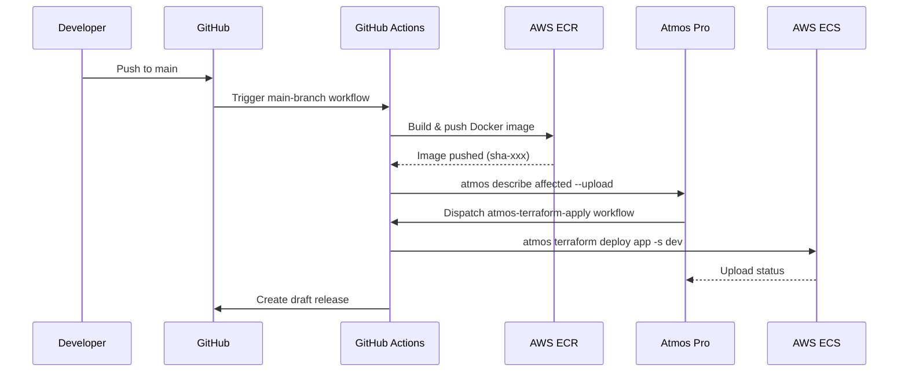
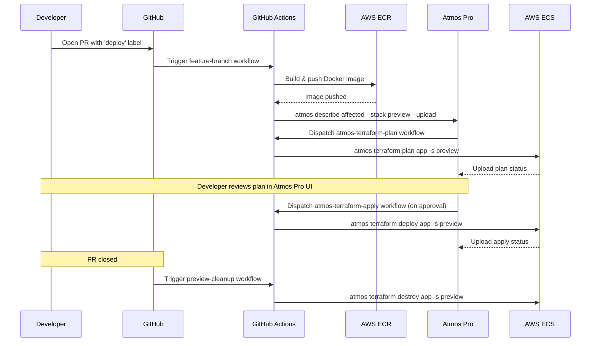
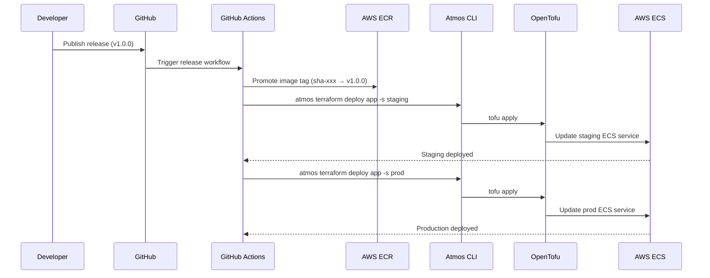
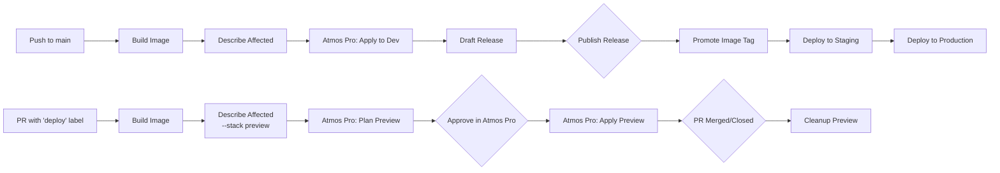

# Workflows

GitHub Actions CI/CD pipelines, orchestrated by [Atmos Pro](https://atmos.tools/pro).

| Workflow | Trigger | Action |
|----------|---------|--------|
| `main-branch.yaml` | Push to `main` | Build image → Describe affected → Atmos Pro triggers apply → Draft release |
| `feature-branch.yml` | PR with `deploy` label | Build image → Describe affected (preview) → Atmos Pro triggers plan |
| `atmos-terraform-plan.yaml` | Workflow dispatch (Atmos Pro) | Run `atmos terraform plan` and upload status |
| `atmos-terraform-apply.yaml` | Workflow dispatch (Atmos Pro) | Run `atmos terraform deploy` and upload status |
| `atmos-pro-list-deployments.yaml` | Daily schedule / manual | Sync instance inventory to Atmos Pro |
| `release.yaml` | Published release | Promote image → Deploy to staging and prod |
| `preview-cleanup.yml` | PR closed | Destroy preview environment |
| `validate.yml` | Pull request | Run validation checks |
| `labeler.yaml` | Pull request | Auto-label based on changed files |

## Main Branch Workflow

## Feature Branch Workflow (Preview via Atmos Pro)

## Release Workflow

## Environment Promotion Flow

