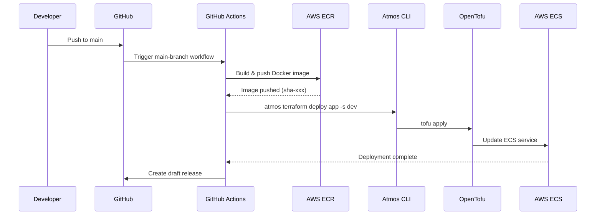
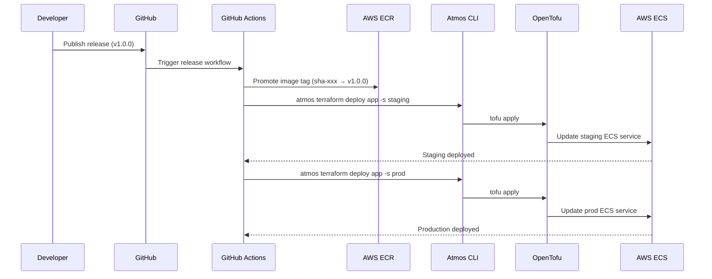
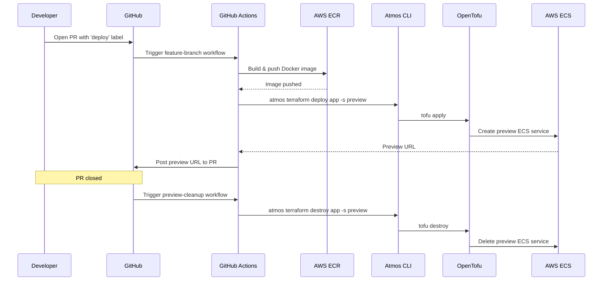
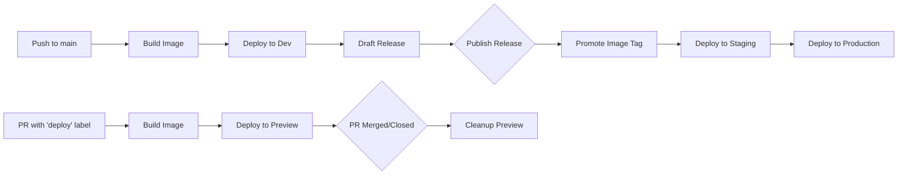

# Workflows

GitHub Actions CI/CD pipelines.

| Workflow | Trigger | Action |
|----------|---------|--------|
| `main-branch.yaml` | Push to `main` | Build image → Deploy to dev → Create draft release |
| `release.yaml` | Published release | Promote image → Deploy to staging and prod |
| `feature-branch.yml` | PR with `deploy` label | Build image → Deploy to preview environment |
| `preview-cleanup.yml` | PR closed | Destroy preview environment |
| `validate.yml` | Pull request | Run validation checks |
| `labeler.yaml` | Pull request | Auto-label based on changed files |

## Main Branch Workflow

## Release Workflow

## Feature Branch Workflow (Preview Environments)

## Environment Promotion Flow

