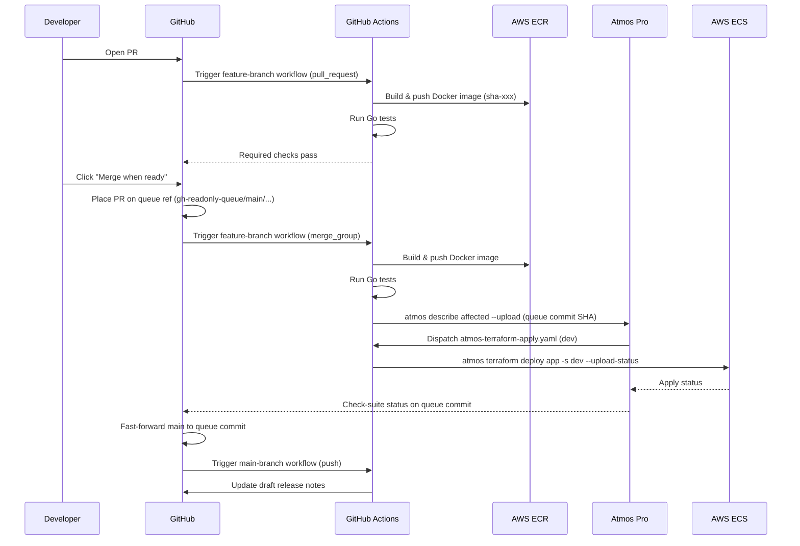
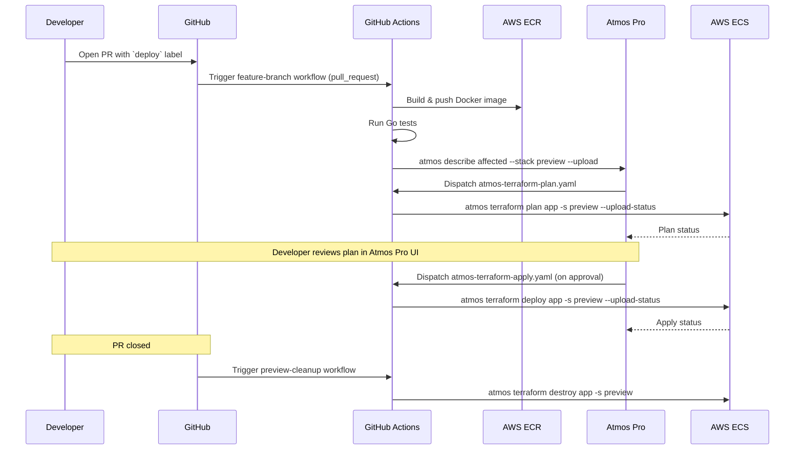
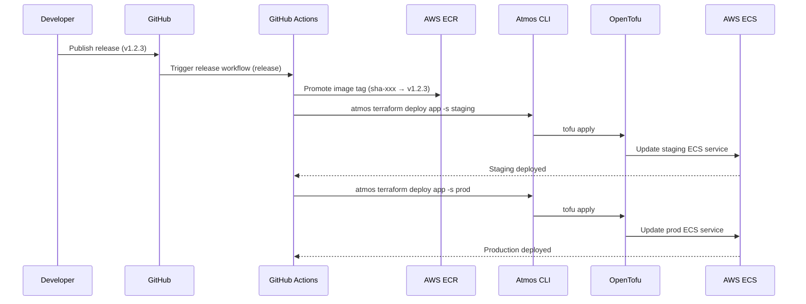
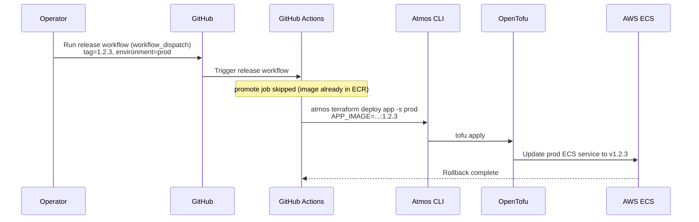
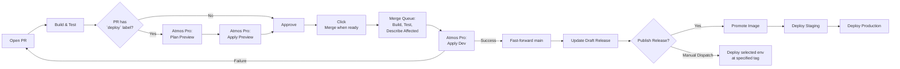

# Workflows

GitHub Actions CI/CD pipelines, orchestrated by [Atmos Pro](https://atmos.tools/pro) for dev/preview and direct for staging/prod.

| Workflow | Trigger | Action |
|----------|---------|--------|
| `feature-branch.yml` | Pull request, merge queue | Build image, run tests; on PR with `deploy` label, `describe affected --stack preview` (Atmos Pro plans preview); on merge queue, `describe affected` (Atmos Pro applies dev) |
| `validate.yml` | Pull request, merge queue | Lint CODEOWNERS |
| `main-branch.yaml` | Push to `main` | Update draft release notes |
| `release.yaml` | Published release, manual dispatch | Promote image, deploy to staging and/or prod |
| `atmos-terraform-plan.yaml` | Workflow dispatch (Atmos Pro) | Run `atmos terraform plan` and upload status |
| `atmos-terraform-apply.yaml` | Workflow dispatch (Atmos Pro) | Run `atmos terraform deploy` and upload status |
| `atmos-pro-list-deployments.yaml` | Daily schedule / manual | Sync instance inventory to Atmos Pro |
| `preview-cleanup.yml` | PR closed | Destroy preview environment |
| `labeler.yaml` | Pull request | Auto-label based on changed files |

## Conventions

### Workflows are named by trigger context

Workflow files are named for *where they fire from* (a feature branch, the main branch, a release event), not for what they do (CI/CD). Functions blur as workflows evolve — the dev deploy is technically "CD" but lives in the file that gates feature-branch merges. The trigger context, however, is fixed and unambiguous: each workflow has exactly one trigger origin. That makes trigger-based names durable.

### Dev deploy runs in the merge queue, dispatched by Atmos Pro — not on push to `main`

The merge queue runs `build` + `test` + `describe affected` on a temporary commit (the PR rebased on top of `main`). `atmos describe affected --upload` reports the queue commit's affected stacks to Atmos Pro, which dispatches `atmos-terraform-apply.yaml` via `workflow_dispatch`. The dispatched apply runs `atmos terraform deploy --upload-status`, which posts a status check on the queue commit. The merge queue waits on that status check; if the apply fails, the PR is rejected from the queue and never lands on `main`.

This catches a broken Terraform apply *before* it breaks dev — a stronger guarantee than deploying after merge and noticing the failure. Nothing in this repo runs `atmos terraform deploy` directly; everything goes through Atmos Pro's dispatch flow.

The `push: main` event then fires on a commit that has already been built, tested, and dev-applied. `main-branch.yaml` therefore only updates the draft release; it does not redo work the queue already did.

### Staging and prod deploys do NOT run in the merge queue

GitHub environments support required reviewers (manual approval gates). If the prod environment requires approval and a queued PR is paused waiting for a human, every PR queued behind it is also blocked — head-of-line blocking. For high-PR-volume teams this collapses queue throughput.

To preserve queue throughput while keeping a human gate on production, staging/prod deploys run from `release.yaml` instead of from the queue. Releases are explicitly triggered (or manually dispatched), so any approval delay only blocks that release, not other PRs.

### `release.yaml` supports `workflow_dispatch` for rollback and out-of-band deploys

Triggering on `release: published` is great for "deploy the new version," but useless for "redeploy v1.2.3 to prod because v1.2.4 broke." `release.yaml` accepts a `tag` input (any image tag in ECR) and an `environment` input (`staging`, `prod`, or `both`), so you can roll back, hotfix, or selectively redeploy without cutting a new release. The `promote` job is skipped on dispatch (the image already exists at that tag).

### Merge queue is required for `main`

Apply only runs from `merge_group.checks_requested` in `terraform/stacks/defaults/atmos-pro.yaml` — there is no `pull_request.merged` backstop. Per the [Atmos Pro docs](https://atmos-pro.com/docs/configure/stacks#github-merge-queue-mergegroup), configuring both would apply twice for the same change.

Branch protection on `main` is configured to require the queue, so a PR cannot land without going through it and applying successfully. If the queue is ever bypassed (e.g. admin push) and dev drifts from `main`, recover by manually dispatching `atmos-terraform-apply.yaml` (`component=app`, `stack=dev`, `sha=<main-sha>`, `github_environment=dev`) or running `atmos terraform deploy app -s dev` locally from the corresponding ref.

## Pull Request → Merge Queue → Dev (via Atmos Pro)

```mermaid
sequenceDiagram
    participant Dev as Developer
    participant GH as GitHub
    participant GA as GitHub Actions
    participant ECR as AWS ECR
    participant AP as Atmos Pro
    participant ECS as AWS ECS

    Dev->>GH: Open PR
    GH->>GA: Trigger feature-branch workflow (pull_request)
    GA->>ECR: Build & push Docker image (sha-xxx)
    GA->>GA: Run Go tests
    GA-->>GH: Required checks pass
    Dev->>GH: Click "Merge when ready"
    GH->>GH: Place PR on queue ref (gh-readonly-queue/main/...)
    GH->>GA: Trigger feature-branch workflow (merge_group)
    GA->>ECR: Build & push Docker image
    GA->>GA: Run Go tests
    GA->>AP: atmos describe affected --upload (queue commit SHA)
    AP->>GA: Dispatch atmos-terraform-apply.yaml (dev)
    GA->>ECS: atmos terraform deploy app -s dev --upload-status
    ECS-->>AP: Apply status
    AP-->>GH: Check-suite status on queue commit
    GH->>GH: Fast-forward main to queue commit
    GH->>GA: Trigger main-branch workflow (push)
    GA->>GH: Update draft release notes
```

## Pull Request → Preview Environment (via Atmos Pro, label-gated)

```mermaid
sequenceDiagram
    participant Dev as Developer
    participant GH as GitHub
    participant GA as GitHub Actions
    participant ECR as AWS ECR
    participant AP as Atmos Pro
    participant ECS as AWS ECS

    Dev->>GH: Open PR with `deploy` label
    GH->>GA: Trigger feature-branch workflow (pull_request)
    GA->>ECR: Build & push Docker image
    GA->>GA: Run Go tests
    GA->>AP: atmos describe affected --stack preview --upload
    AP->>GA: Dispatch atmos-terraform-plan.yaml
    GA->>ECS: atmos terraform plan app -s preview --upload-status
    ECS-->>AP: Plan status
    Note over Dev,AP: Developer reviews plan in Atmos Pro UI
    AP->>GA: Dispatch atmos-terraform-apply.yaml (on approval)
    GA->>ECS: atmos terraform deploy app -s preview --upload-status
    ECS-->>AP: Apply status
    Note over Dev,GH: PR closed
    GH->>GA: Trigger preview-cleanup workflow
    GA->>ECS: atmos terraform destroy app -s preview
```

## Release → Staging → Prod

```mermaid
sequenceDiagram
    participant Dev as Developer
    participant GH as GitHub
    participant GA as GitHub Actions
    participant ECR as AWS ECR
    participant Atmos as Atmos CLI
    participant TF as OpenTofu
    participant ECS as AWS ECS

    Dev->>GH: Publish release (v1.2.3)
    GH->>GA: Trigger release workflow (release)
    GA->>ECR: Promote image tag (sha-xxx → v1.2.3)
    GA->>Atmos: atmos terraform deploy app -s staging
    Atmos->>TF: tofu apply
    TF->>ECS: Update staging ECS service
    ECS-->>GA: Staging deployed
    GA->>Atmos: atmos terraform deploy app -s prod
    Atmos->>TF: tofu apply
    TF->>ECS: Update prod ECS service
    ECS-->>GA: Production deployed
```

## Manual Dispatch (rollback / hotfix)

```mermaid
sequenceDiagram
    participant Op as Operator
    participant GH as GitHub
    participant GA as GitHub Actions
    participant Atmos as Atmos CLI
    participant TF as OpenTofu
    participant ECS as AWS ECS

    Op->>GH: Run release workflow (workflow_dispatch)<br/>tag=1.2.3, environment=prod
    GH->>GA: Trigger release workflow
    Note over GA: promote job skipped (image already in ECR)
    GA->>Atmos: atmos terraform deploy app -s prod<br/>APP_IMAGE=...:1.2.3
    Atmos->>TF: tofu apply
    TF->>ECS: Update prod ECS service to v1.2.3
    ECS-->>GA: Rollback complete
```

## Environment Promotion Flow

```mermaid
graph LR
    A[Open PR] --> B[Build & Test]
    B --> C{PR has<br/>`deploy` label?}
    C -->|Yes| D[Atmos Pro:<br/>Plan Preview]
    C -->|No| E[Approve]
    D --> Dapply[Atmos Pro:<br/>Apply Preview]
    Dapply --> E
    E --> F[Click<br/>Merge when ready]
    F --> G[Merge Queue:<br/>Build, Test,<br/>Describe Affected]
    G --> Gapply[Atmos Pro:<br/>Apply Dev]
    Gapply -->|Success| H[Fast-forward main]
    Gapply -->|Failure| A
    H --> I[Update Draft Release]
    I --> J{Publish Release?}
    J -->|Yes| K[Promote Image]
    K --> L[Deploy Staging]
    L --> M[Deploy Production]
    J -->|Manual Dispatch| N[Deploy selected env<br/>at specified tag]
```
